# Hotel Management System

## Overview
The Hotel Management System is a comprehensive software solution designed to streamline the operations of hotels.
This system facilitates the management of hotel activities including room booking, guest management, staff management, and report generation.
It is built using Java and Maven, ensuring a robust and scalable application.<br><br>
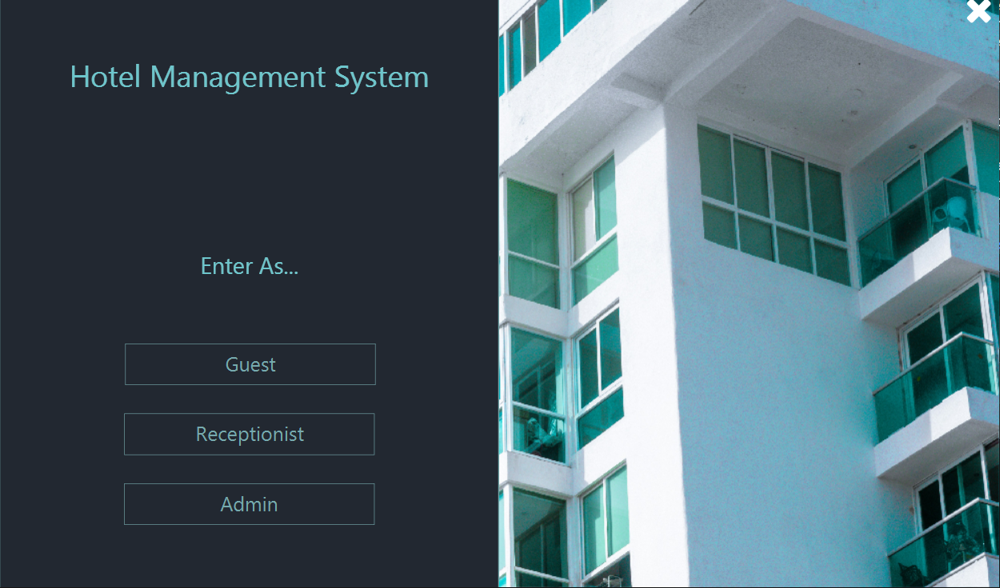

## Features
The Hotel Management System offers a wide range of features to help hotels manage their operations more efficiently. Some of the key features include:

### User Authentication
- **Purpose:** To ensure that only authorized users can access the system.
- **Functionality:** Includes login and signup options for different types of users (guests, admins, receptionists). In addition, the system also supports:
    - **Forget Password**: Allows users to reset their password through a secure process, typically involving verification via national ID and username.
    - **Unique Fields for Registration**: During registration, users can optionally provide their email and/or phone number, which must be unique to each user.
    This aids in account recovery and provides an additional layer of user verification.
    - **Role-based access:** Different users have different levels of access to the system. For example, guests can only book rooms, while admins can manage staff and generate reports.
    - **Profile Management:** Users can see and update their profile information, such as name, email, phone number, and password.
#### Screenshots:

<div align = center>

**`Login Window`**
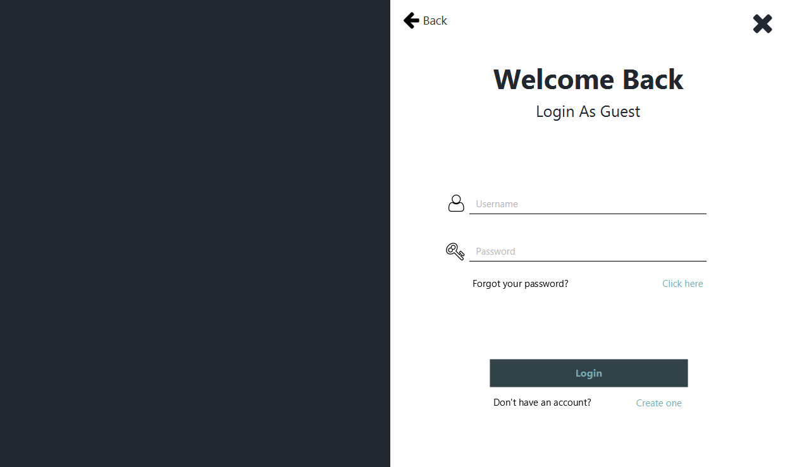<br><br>
**`Sign Up Window`**
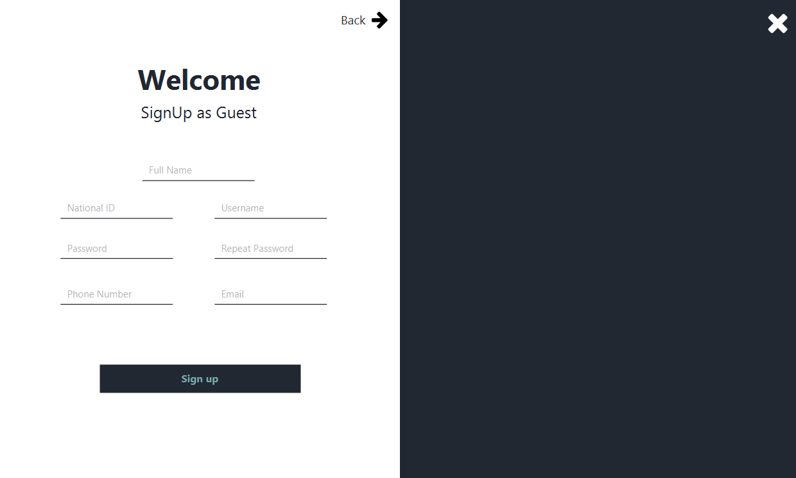<br><br>
**`Forget Password Window`**
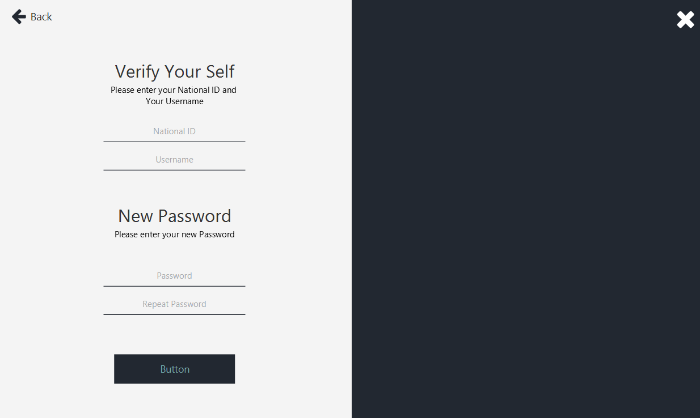<br><br>
**`Profile Window`**
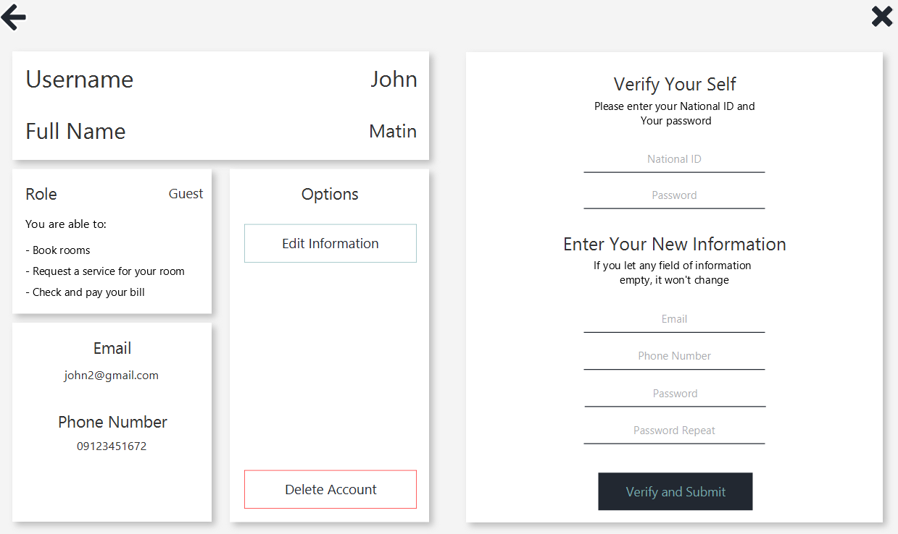<br><br>

</div>

### Room Management
- **Purpose:** To manage the rooms available in the hotel.
- **Functionality:** Includes adding, updating, removing, and searching for rooms. Each room has a unique room number, type, and price. The system also supports:
    - **Room Types:** Different types of rooms (e.g., single, double, suite) with different prices.
    - **Room Status:** Each room can be in one of several states, such as available, booked, or under maintenance.
    - Allows admin to add new rooms, update existing room details, remove rooms from the system, and search for rooms based on various criteria (e.g., availability, room type).
#### Screenshots:
<div align = center>

**`Room Management Window`**
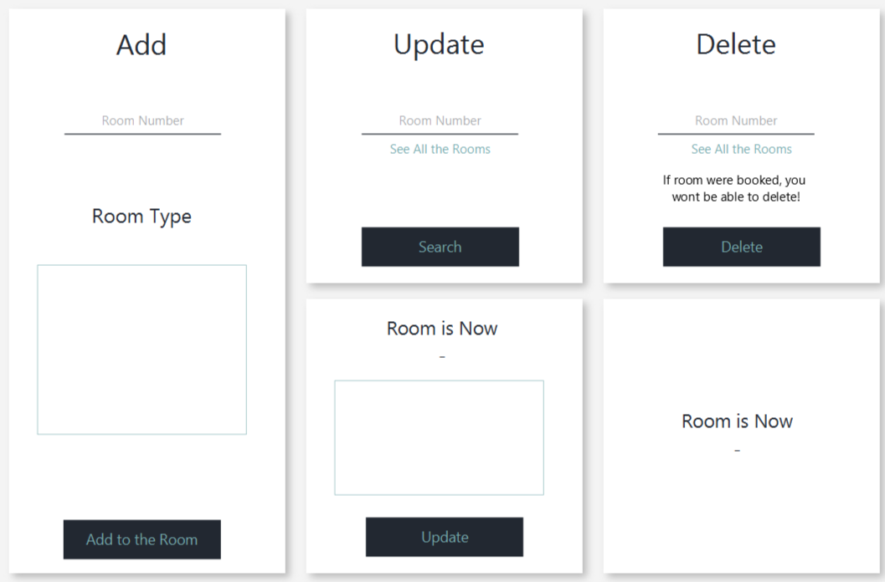<br><br>
**`Search Room Window`**
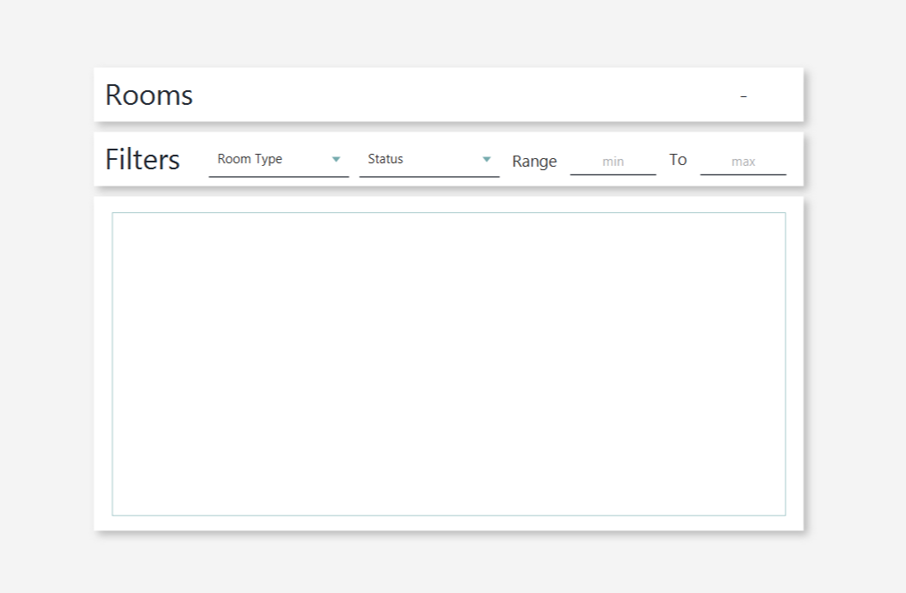<br><br>

</div>


### Reservation Management
- **Purpose:** To manage room reservations made by guests.
- **Functionality:** Includes booking rooms, changing reservations, and checking in and out. The system also supports:
    - **Reservation Details:** Each reservation has a unique reservation ID, room number, guest ID, check-in and check-out dates, and status.
    - **Check-in/Check-out:** Guests can check in and out of their rooms, which updates the room status accordingly.
    - **Reservation Modification:** Guests can modify their reservations, such as changing the check-in date or number of nights.
#### Screenshots:
<div align = center>

**`Reservation Window`**
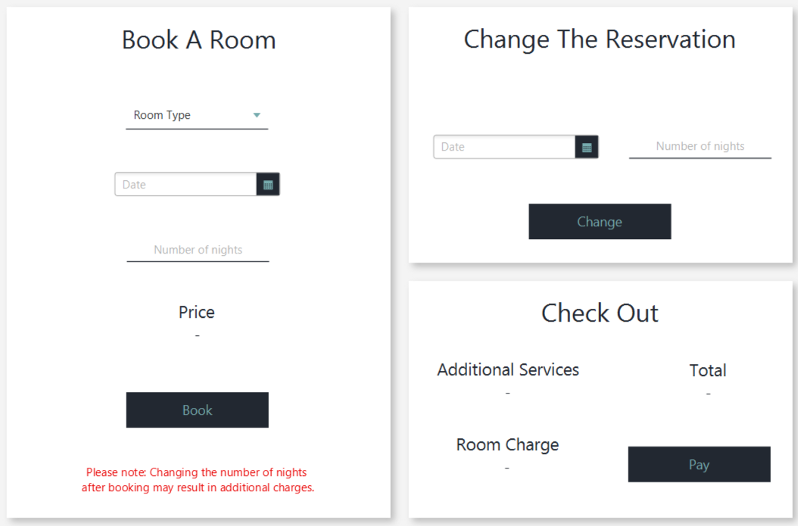<br><br>
**`Check-In/Check-Out Window`**
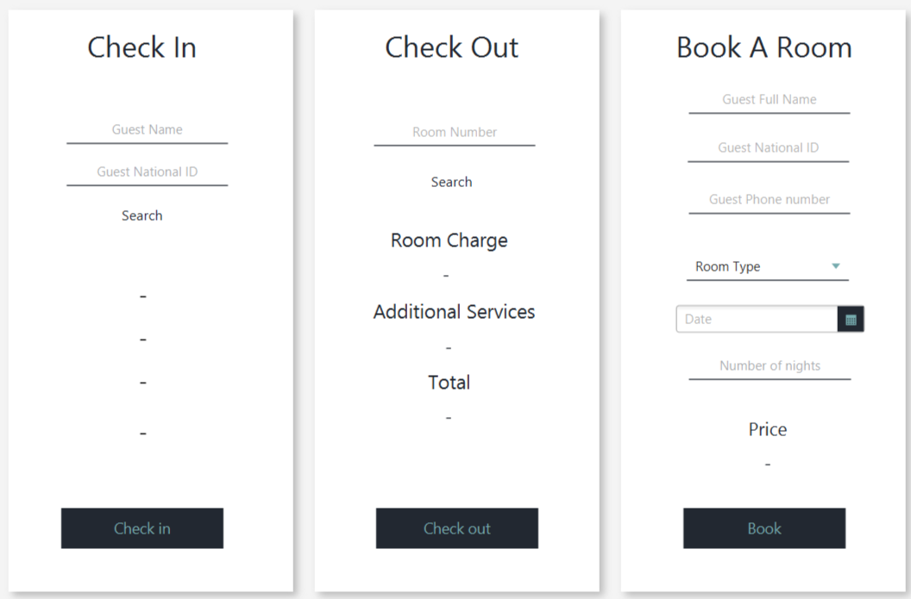<br><br>

</div>

### Service Management
- **Purpose:** To allow guests to request services during their stay.
- **Functionality:** Includes a list of services that guests can request, such as room cleaning, laundry, or room service. The system also supports:
    - **Service Requests:** Guests can request services directly through the system, which are then assigned to staff for completion.
    - **Service Status:** Each service request has a status (e.g., pending, in progress, completed) that is updated as the request is processed.
#### Screenshots:
<div align = center>

**`Service Request Window`**
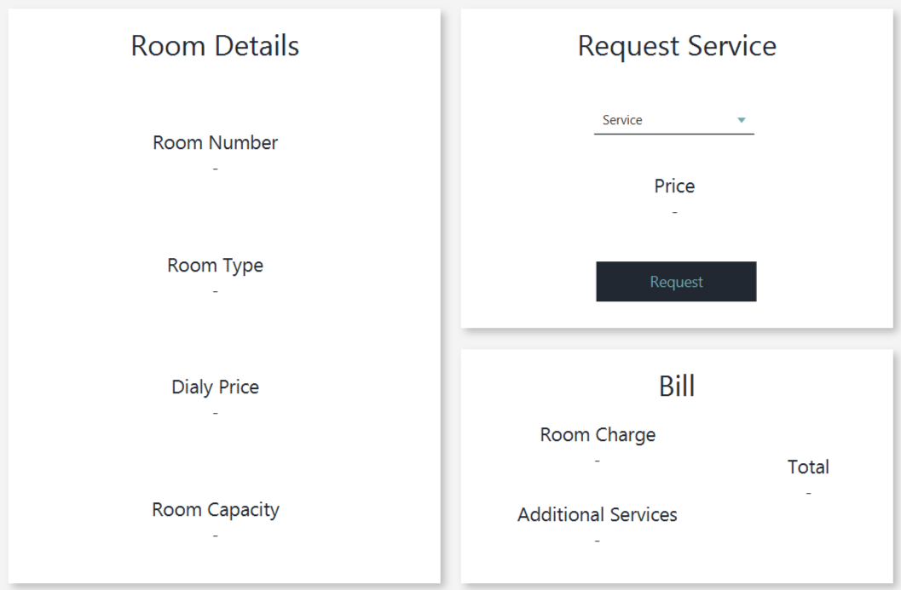<br><br>

</div>

### Billing
- **Purpose:** To automate the billing process for guests.
- **Functionality:** Includes automated bill generation and payment processing. The system also supports:
    - **Bill Details:** Each bill includes the room price, service charges, and total amount due.
    - **Payment Processing:** Guests can pay their bills through the system.


### Reports
- **Purpose:** To generate various reports for hotel management.
- **Functionality:** Includes the generation of reports such as check-in/check-out reports, billing reports, and occupancy reports. The system also supports:
    - **Custom Reports:** Admins can generate custom reports based on specific criteria, such as room type, date range, or guest name.
    - **Export Reports:** Reports can be exported in various formats, such as PDF, Excel, or CSV.
#### Screenshots:
<div align = center>

**`Report Window`**
<br><br>
**`Check-In/Check-Out Report Window`**
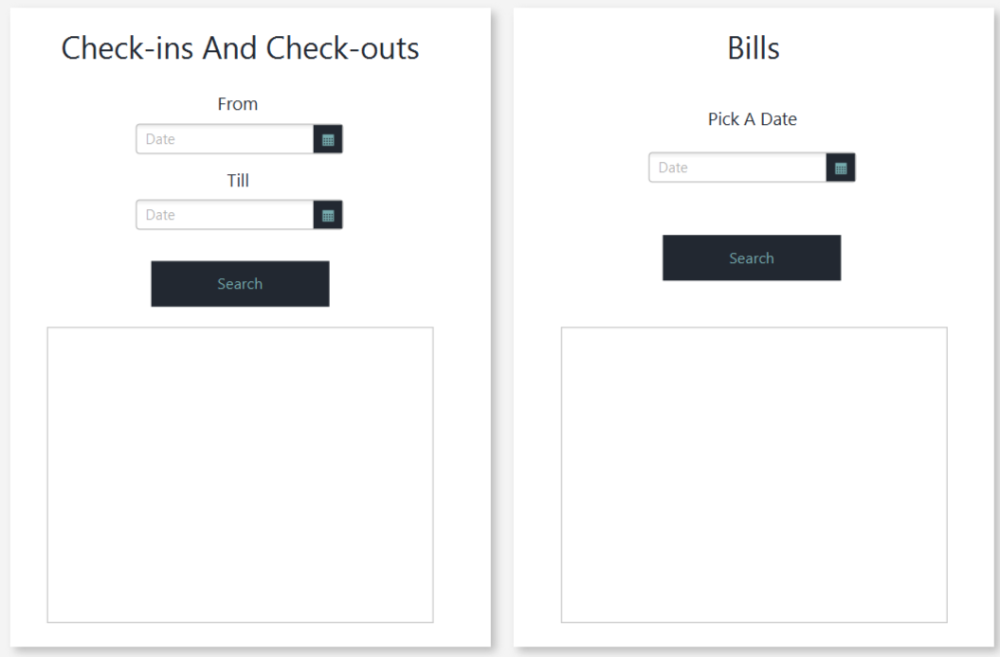<br><br>

</div>

## Architecture
The system utilizes a client-server architecture to manage interactions between the hotel management software's users and the system's backend. Here's a detailed explanation of the logic behind this architecture:

### Overview
The client-server architecture is a model that divides the system into two distinct entities: the client and the server.
The client is responsible for sending requests to the server, which processes these requests and sends back the appropriate response.
This model is widely used in software development due to its scalability, security, and ease of maintenance.

### Components
- **Client:** The client is the user interface that interacts with the system. In the Hotel Management System,
  the client is the JavaFX application that users interact with to perform various tasks, such as booking rooms,
  managing reservations, and generating reports.
- **Server:** The server is the backend of the system that processes requests from the client and sends back responses.
  In the Hotel Management System, the server is responsible for handling user authentication, room management, reservation management,
  service requests, billing, and report generation.
- **ClientHandler:** The ClientHandler class is responsible for handling client requests and sending responses back to the client.
- **Request:** The Request class represents a request sent by the client to the server. It contains information such as the request type,
  the user who sent this request and data.
- **Response:** The Response class represents a response sent by the server to the client. It contains information such as the response type and data.

### Communication
- **Java Socket:** The system uses Java sockets for network communication between the client and server. Sockets provide a bidirectional communication channel for sending and receiving data.
- **Request and Response Model:** The client sends a request to the server, encapsulated in a Request object that includes the request type, user information, and any additional data needed for the request(Map).
  The server processes this request and sends back a response, which could be data (e.g., room details, reservation confirmation) or a status message indicating the outcome of the request.

### Request Handling
- **Request Types:** The Request class defines various request types, such as LOGIN, BOOK_ROOM, REQUEST_SERVICE, etc. These types help the server understand what action is being requested.
- **Server Logic:** Upon receiving a request, the server determines the type of request and calls the appropriate method to handle it. For example, a BOOK_ROOM request would trigger the server
  to check room availability, book the room if available, and update the database accordingly.
- **Database Interaction:** The server interacts with the database using JDBC for data storage and retrieval. It uses DAO (Data Access Object) patterns to abstract and encapsulate all access to the data source.

### Example: Booking a Room
1. **Client Request:** The client sends a BOOK_ROOM request with details about the room type, check-in and check-out dates, and guest information.
2. **Server Processing:**
   - The server receives the request and identifies it as a BOOK_ROOM request.
   - It queries the database to find available rooms that match the criteria.
   - If an available room is found, the server books the room, updates its status in the database, and generates a reservation ID.
3. **Server Response:** The server sends a response back to the client, including the reservation ID and booking details, or an error message if no room is available.

## Prerequisites
- Java JDK 11 or later 
- Maven 3.6.3 or later
- OrmLite 6.1.0 or later
- sqlite-jdbc 3.46.0 or later
- slf4j-api 2.0.13 or later
- JFoenix 9.0.10 or later
- JavaFX 17 or later
- FontAwesomeFX 8.2

### Technologies Used
- Backend: Java
- Frontend: JavaFX
- Database: SQLite
- Build Tool: Maven
- ORM: OrmLite

## Installation
1. Clone the repository:
    ```bash
    git clone https://github.com/John-6670/HotelManagementSystem
   ```
2. Navigate to the project directory:
    ```bash
    cd HotelManagementSystem
    ```
3. Build the project using Maven:
    ```bash
    mvn clean install
    ```